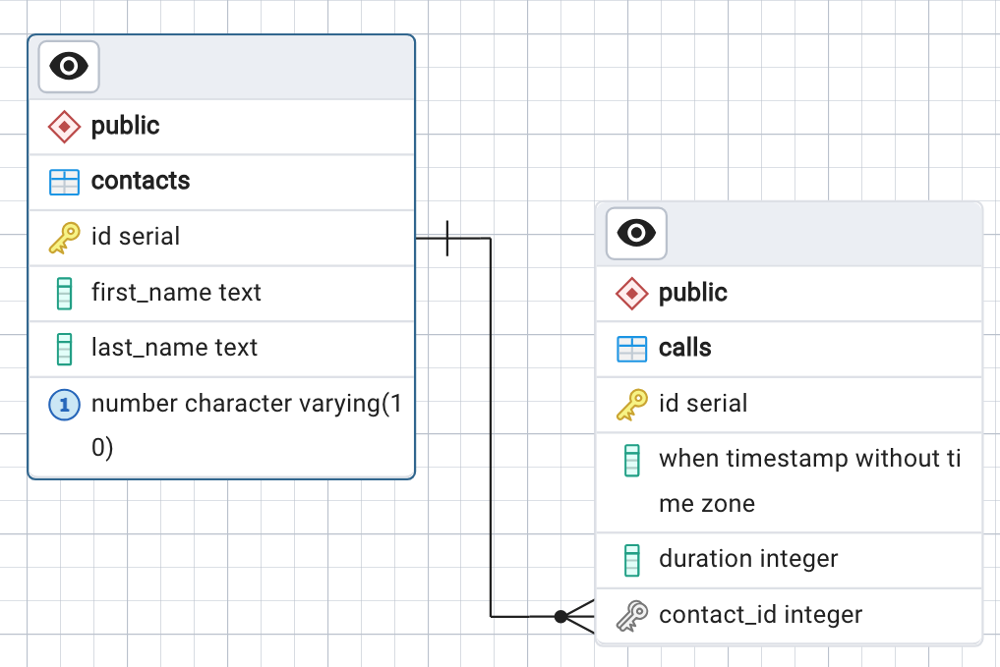

# LS180 Lesson 3

## Assignment 8 Practice Problems: One-to-Many Relationships

### Question 7

Draw an entity-relationship diagram for the data we've been working with in this
assignment.

### Solution

Below is a `pgAdmin`-generated ERD for this assignment's database schema:

